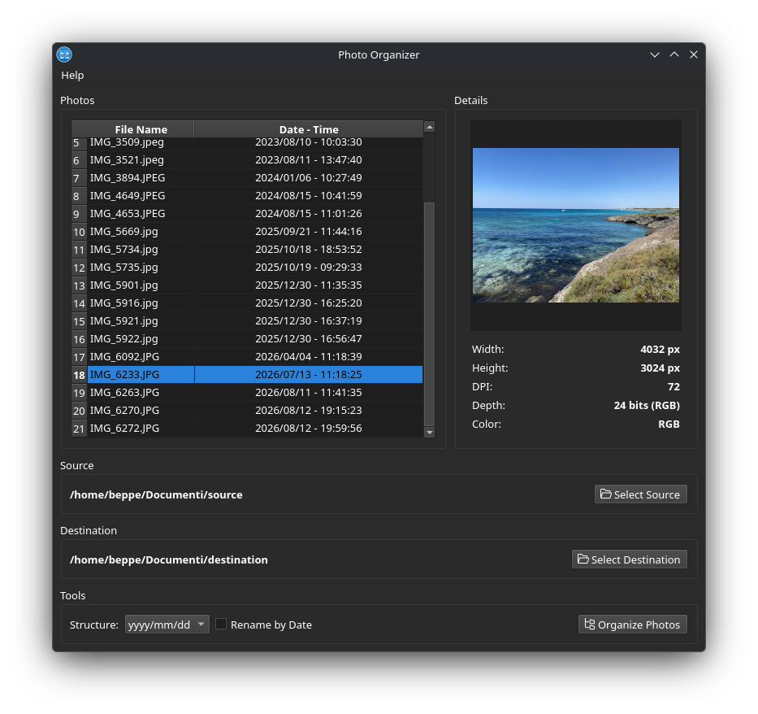

# Photo Organizer

[](https://www.gnu.org/licenses/lgpl-3.0)
[](https://www.python.org/)
[](https://pypi.org/project/PySide6/)
[](https://flathub.org/)

A simple cross-platform desktop application to organize your photos into folders based on their EXIF date.



---

## Table of Contents

- [Features](#features)
- [Screenshots](#screenshots)
- [Installation](#installation)
  - [Linux (Flatpak) — recommended](#linux-flatpak--recommended)
  - [From source (any OS)](#from-source-any-os)
- [Usage](#usage)
- [Requirements](#requirements)
- [Project structure](#project-structure)
- [Building the Flatpak locally](#building-the-flatpak-locally)
- [Contributing](#contributing)
- [License](#license)
- [Author](#author)
- [Acknowledgements](#acknowledgements)

---

## Features

- 📅 **EXIF-based organization** — reads the original capture date from image metadata
- 🗂️ **Flexible folder structure** — choose between `yyyy`, `yyyy/mm`, or `yyyy/mm/dd`
- 🔍 **Recursive scanning** — automatically scans all subdirectories of the source folder
- ✏️ **Optional renaming** — rename files using their Date & Time (e.g. `2024-03-15_14-30-22.jpeg`)
- 🖼️ **Live preview** — inspect image dimensions, DPI, color model and depth before organizing
- 🌙 **Dark theme** — clean dark UI built with PySide6 (Qt for Python)
- 📦 **Flatpak ready** — easy installation on any Linux distribution

---

## Screenshots


---

## Installation

### Linux (Flatpak) — recommended

The easiest way to install Photo Organizer on Linux is via [Flathub](https://flathub.org/):

```bash
flatpak install flathub it.giuseppecigala.PhotoOrganizer
flatpak run it.giuseppecigala.PhotoOrganizer
```

> **Note**: The Flatpak package will be available on Flathub once the submission is approved.

### From source (any OS)

#### Requirements

- Python 3.10 or newer
- PySide6 >= 6.6.0
- Pillow >= 10.0.0

#### Steps

```bash
# 1. Clone the repository
git clone https://github.com/giuseppecigala/PhotoOrganizer.git
cd PhotoOrganizer

# 2. Create a virtual environment
python3 -m venv .venv

# 3. Activate it
source .venv/bin/activate      # Linux / macOS
# .venv\Scripts\activate       # Windows

# 4. Install dependencies
pip install -r requirements.txt

# 5. Run the application
python3 main.py
```

---

## Usage

1. Click **Select Source** and choose the folder containing your photos.
   All subfolders are scanned automatically.
2. Click **Select Destination** and choose where the organized photos will be copied.
3. Pick a folder structure from the **Structure** dropdown
   (`yyyy`, `yyyy/mm`, or `yyyy/mm/dd`).
4. Optionally enable **Rename by Date** to replace original filenames
   (e.g. `IMG1234.jpeg`) with the EXIF Date & Time (e.g. `2024-03-15_14-30-22.jpeg`).
5. Click **Organize Photos** to start the operation.

**The original files are never modified or deleted** — Photo Organizer only copies them to the destination.

### Example

Given a source folder containing:

```
IMG_0001.jpeg   (taken 2023-07-12 09:15:33)
IMG_0002.jpeg   (taken 2024-03-15 14:30:22)
IMG_0003.jpeg   (taken 2024-03-15 18:05:10)
```

With structure `yyyy/mm/dd` and **Rename by Date** enabled, the destination will look like:

```
2023/07/12/2023-07-12_09-15-33.jpeg
2024/03/15/2024-03-15_14-30-22.jpeg
2024/03/15/2024-03-15_18-05-10.jpeg
```

---

## Requirements

| Component | Minimum version |
|-----------|-----------------|
| Python    | 3.10            |
| PySide6   | 6.6.0           |
| Pillow    | 10.0.0          |

---

## Project structure

```
PhotoOrganizer/
├── main.py                                       # Application entry point
├── requirements.txt                              # Python dependencies
├── resources/                                    # Icons and license
│   ├── app_icon.png
│   ├── folder.png
│   ├── organize.png
│   └── license.txt
├── it.giuseppecigala.PhotoOrganizer.json         # Flatpak manifest
├── it.giuseppecigala.PhotoOrganizer.desktop      # Desktop entry
├── it.giuseppecigala.PhotoOrganizer.metainfo.xml # AppStream metadata
├── it.giuseppecigala.PhotoOrganizer.png          # Application icon (128x128)
└── README.md
```

---

## Building the Flatpak locally

If you want to build and test the Flatpak package on your machine:

```bash
# 1. Install the required runtimes
flatpak install flathub \
    org.kde.Platform//6.10 \
    org.kde.Sdk//6.10 \
    io.qt.PySide.BaseApp//6.10

# 2. Clean previous build artifacts
rm -rf .flatpak-builder build-dir repo

# 3. Build and install
flatpak-builder --force-clean --user --install \
    --disable-rofiles-fuse \
    --repo=repo \
    build-dir it.giuseppecigala.PhotoOrganizer.json

# 4. Run the application
flatpak run it.giuseppecigala.PhotoOrganizer
```

> **Tip**: If you encounter `rofiles-fuse` errors, the `--disable-rofiles-fuse`
> flag works around a known compatibility issue with some FUSE setups.

---

## Contributing

Contributions, bug reports and feature requests are welcome.

1. Fork the repository
2. Create a feature branch
   ```bash
   git checkout -b feature/my-feature
   ```
3. Commit your changes
   ```bash
   git commit -m "Add my feature"
   ```
4. Push to the branch
   ```bash
   git push origin feature/my-feature
   ```
5. Open a Pull Request

Please open an issue first for major changes so we can discuss the approach.

---

## License

Photo Organizer is free software released under the
**GNU Lesser General Public License v3.0 or later**.

See the [LICENSE](LICENSE) file for the full text.

This application uses [PySide6](https://www.qt.io/qt-for-python),
which is licensed under the LGPL v3.

---

## Author

**Giuseppe Cigala**

- GitHub: [@giuseppecigala](https://github.com/giuseppecigala)

---

## Acknowledgements

- [Qt for Python (PySide6)](https://www.qt.io/qt-for-python) — GUI framework
- [Pillow](https://python-pillow.org/) — image processing
- [Flathub](https://flathub.org/) — Linux app distribution
